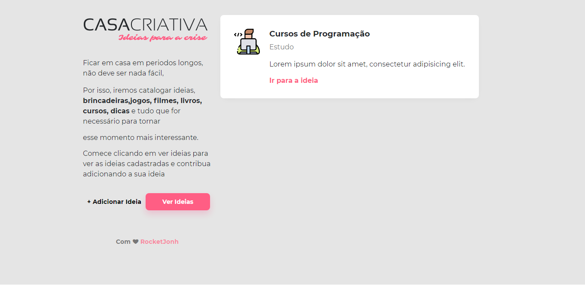
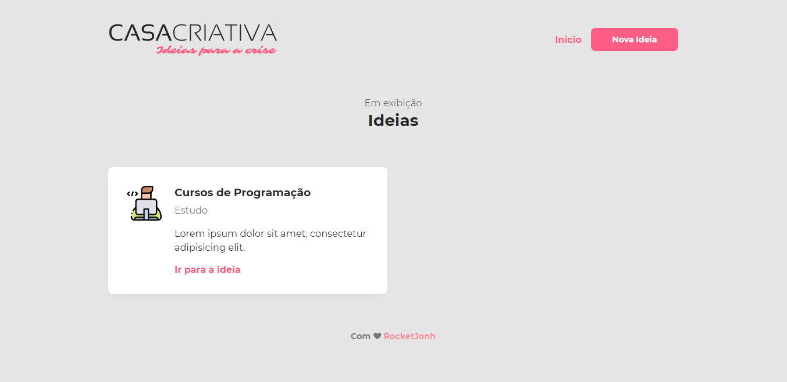
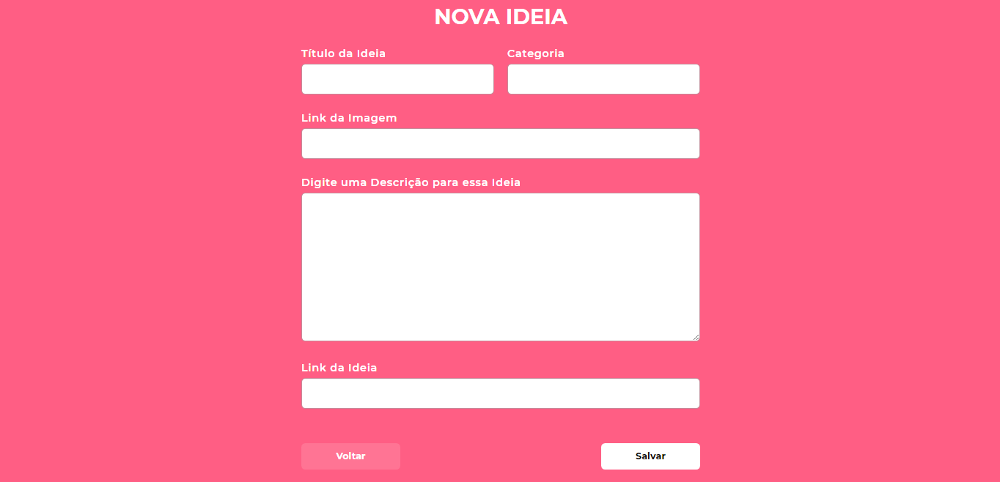

<h1 align="center">
  🏠 Casa Criativa 🏠
 </h1>
  <h2 align="center">
  Sistema de cadastro de ideias com o intuito de tornar

   
  o momento de isolamento mais agradável.
</h2>

<h3>
  👨🏻‍💻 Front-end
</h3>

<ul>
  <li> <strong> HTML5 </strong> </li>
  <li> <strong> CSS3 </strong> </li>
  <li> <strong> JavaScript </strong> </li>
</ul>

<h3>
  👨🏻‍💻 Back-end
</h3>

<ul>
  <li> <strong> Node.js </strong> </li>
  <li> <strong> SQLite 3 </strong> </li>
</ul>

<h3>
  ⛓️ Dependências
</h3>

<ul>
  <li> <strong> Express </strong> </li>
  <li> <strong> Nodemon </strong> </li>
  <li> <strong> Nunjucks </strong> </li>
  <li> <strong> Sqlite3 </strong> </li>
</ul>

<h3 align="center">
 🖼️ Imagens
</h3>

<h3>
  ⚙️ Para rodar a aplicação:
</h3>

<ul>
  <li>  Clone esse repositório.  </li>
  <li>  Execute <strong> npm install </strong> dentro da pasta criada.  </li>
  <li>  Rode <strong> npm run dev. </strong> </li>
  <li>  Acesse a aplicação, localhost:3000.  </li>
</ul>

---

🚀 [Rocketseat](https://rocketseat.com.br/)

Instrutor:[Mayk Brito](https://github.com/maykbrito)

Licença
[MIT](LICENSE)

